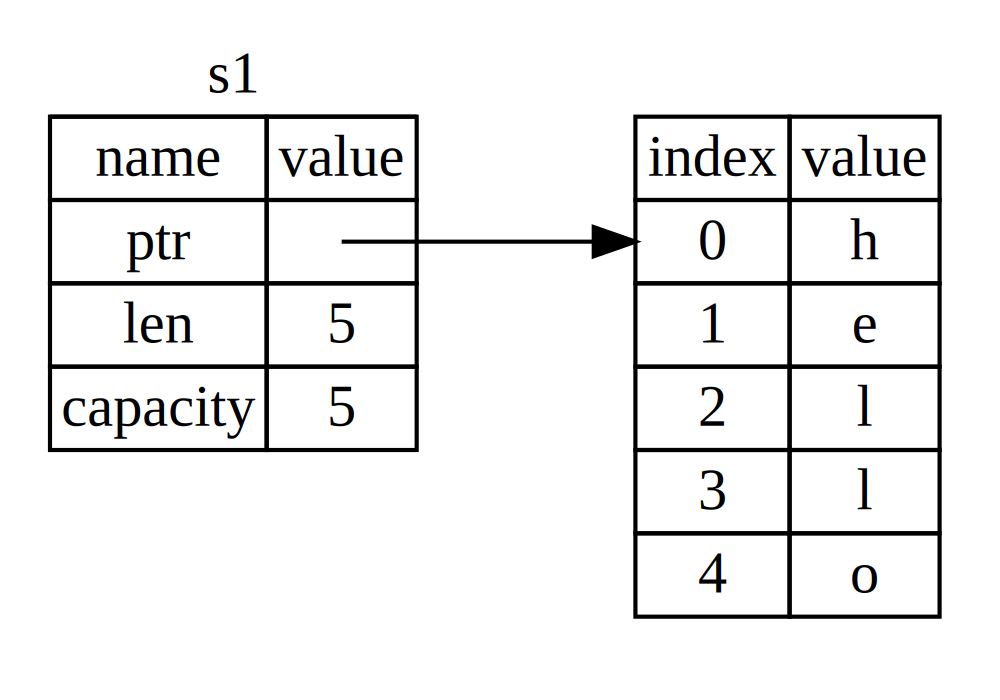
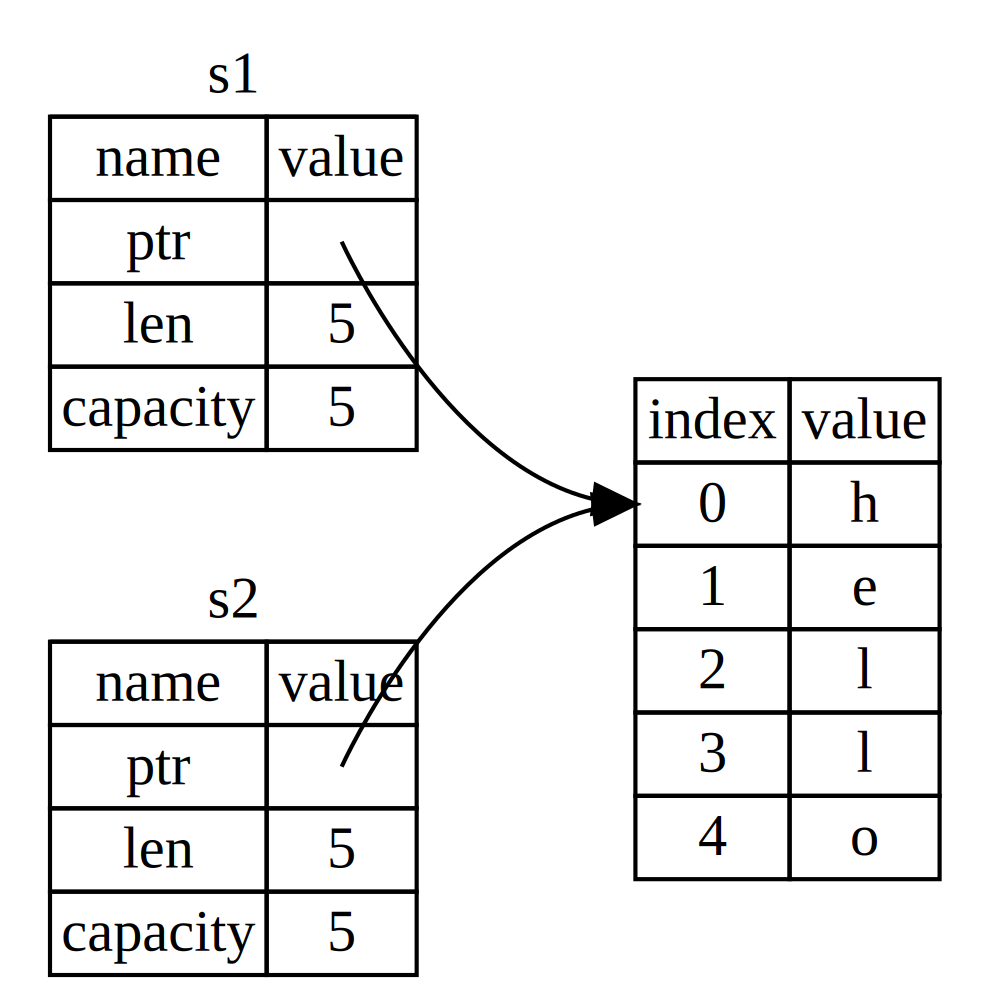
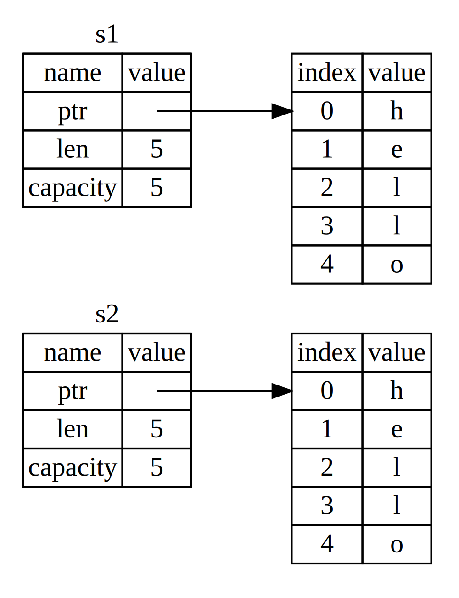
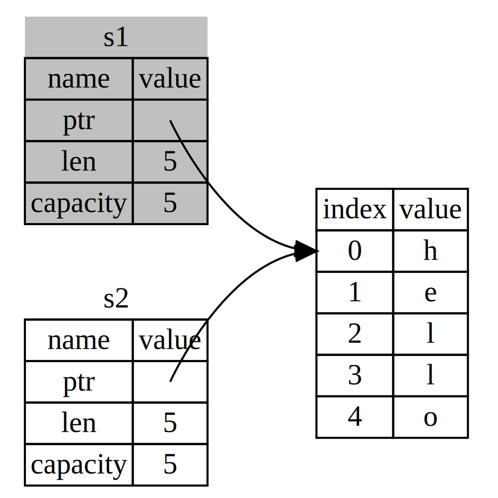

# What is Ownership?

Ownership 은 Rust 가 메모리를 관리하는 방법입니다.  
Memory 관리는 보통 garbage collector 를 두던가 명시적으로 할당과 해제를 기재하는 방식을 사용하던가 해서 관리하게 됩니다.  
Rust 는 다른 언어들과는 다르게 메모리를 관리합니다. rust 에서는 ownership 이라는 규칙을 두어 compiler 가 확인하게 합니다.  
이 규칙이 지켜지지 않는다면 compile 되지 않습니다.


## Ownership Rules

* Rust 에서 각 변수는 owner 를 가지고 있음
* owner 는 한 번에 하나만 있을 수 있음
* owner 가 scope 를 벗어 났을때, 변수는 삭제됨

## Variable Scope

변수는 선언된 시점부터 현재 범위가 끝날 때까지 유효합니다.

```rust
{
let s = "hello";
} // s 는 scope 밖으로 벗어나서 삭제됨
```

# Memory and Allocation

변수가 범위를 벗어나면 Rust 에서 drop 이라는 특별한 함수를 호출하게 됩니다.  
이러한 패턴은 Rust 코드 작성 방식에 큰 영향을 미치고 힙에 할당된 데이터를 여러 변수가 사용하게 하려는 복잡한 상황에서 예상치 못한 결과를 초래할 수도 있습니다.

## Variables and Data Interacting with Move

```rust
let x = 5;
let y = x;
```
우리는 위와 같은 상황에서 x 에 5 라는 값이 할당되고 x 에 있던 값이 복사되어 y 에 할당된다는 것을 추측할 수 있습니다.  
정수는 고정된 크기를 가지고 있는 단순한 값이고, 이 두 개의 5 라는 값은 스택에 푸시되고 있습니다.

이제는 `String` 의 경우를 보겠습니다.

```rust
let s1 = String::from("hello");
let s2 = s1;
```

위의 코드는 어떻게 동작할까요?  
int 형 변수를 할당 하고 복사하는 것과 같은 방식으로 동작할 것 같지만 그렇지 않습니다.

</img>

위 그림은 s1 의 메모리 구조를 그림으로 나타낸 것입니다.  
그림에서 왼쪽은 stack 영역 오른쪽은 heap 영역을 의미합니다.  
String 변수의 stack 메모리 구조를 살펴보면 위 그림 왼쪽과 같이 세 가지 부분으로 나뉩니다.  
ptr 은 실제 값이 저장된 메모리의 주소를 가리키고, len 은 contents 가 사용하고 있는 메모리의 길이를 나타내고, capacity 는 allocator 로 부터 할당된 메모리의 크기를 나타냅니다.

이제 s1 을 s2 에 할당하면 어떤 일이 일어나는지 살펴보겠습니다.

</img>

위 그림에서 볼 수 있듯이 s1 의 값이 s2 로 복사되는 것이 아니라 s1 의 ptr, len, capacity 가 s2 로 복사됩니다.  
즉 heap 의 data 는 복사되지 않고 heap 주소를 가르키는 ptr 이 복사되는 것입니다.

</img>

위 그림과 같이 heap 의 data 도 복사하면 안되는 것일까요?  
만약 Rust 가 위와 같이 동작한다면 `s2 = s1` 과 같은 연산을 수행할 때 heap 의 data 가 크다면 많은 시간이 소요될 것입니다.  
때문에 Rust 에서는 위와 같이 동작하지 않습니다.

앞서 설명하기를 Rust 에서는 변수가 범위를 벗어났을 때 drop 이라는 특별한 함수를 호출한다고 했습니다.  
그런데 두 개의 변수가 같은 메모리를 가르키고 있다면 두 개의 변수가 범위를 벗어나면 두 번의 drop 을 호출하게 됩니다.  
이는 이중 해제 오류를 발생시키고 앞서 언급한 메모리 안전 버그 중 하나입니다.

</img>

Rust 에서는 이러한 문제를 해결하기 위해 `s2 = s1` 과 같은 연산을 수행할 때 위 그림과 같이 s1 의 유효성을 무효화 시킵니다.  
때문에 s1 이 범위를 벗어나도 drop 을 호출하지 않습니다.  

다른 언어에서 *shallow copy* 와 *deep copy* 에 대해 공부해보신적이 있으실 수도 있습니다.  
Rust 에서는 복사 후 첫 번째 변수를 무효화 시키기에 *move* 라는 표현을 사용합니다.

## Variables and Data Interacting with Clone

만약 String 의 heap data 를 deep copy 하고 싶다면 `clone` method 를 사용하면 됩니다.

```rust
let s1 = String::from("hello");
let s2 = s1.clone();

println!("s1 = {}, s2 = {}", s1, s2);
```

## Stack-Only Data: Copy

```rust
let x = 5;
let y = x;

println!("x = {}, y = {}", x, y);
```

위의 코드에서는 clone 의 호출이 없었음에도 x 가 유효한 것을 알 수 있습니다.  
이는 int 와 같은 고정된 크기를 가지는 타입은 stack 에 저장되기 때문입니다.  
때문에 실제 값이 빠르게 복사가 되며 x 가 무효하도록 할 이유가 없습니다.

Rust 에는 Integer 와 같이 stack 에 저장된 type 에 `Copy` trait 이라는 특수 annotation 이 있고, 
이러한 특성을 구현한 Type 은 복사되어 다른 변수에 할당된 후에도 유효할 수 있습니다.

일반적으로 단순한 scalar 값들은 `Copy` trait 을 구현할 수 있으며, 할당이 필요하거나 resource의 형태인 것은 `Copy` trait 을 구현할 수 없습니다.
다음은 Copy trait 을 구현하는 type 들의 몇 가지 유형입니다.

- integer types
- boolean types
- floating point types
- character types
- tuples (`Copy` 를 구현하는 유형만 포함된 경우)

# Ownership and Functions

function 으로 변수를 넘기는 동작 방식은 변수를 다른 변수로 할당하는 동작 방식과 유사합니다.  
function 으로 넘겨지는 변수는 `move` 가 되거나 `copy` 가 됩니다.

```rust
fn main() {
    let s = String::from("hello");  // s 변수가 scope 에 들어옴

    takes_ownership(s);             // s 값이 함수로 이동됨
                                    // ... s 는 더이상 유효하지 않음

    let x = 5;                      // x 변수가 scope 에 들어옴

    makes_copy(x);                  // x 값이 함수로 이동됨
                                    // ... x 는 i32 타입이 Copy trait 을 구현하므로 여전히 유효함

} // 여기서 x 가 scope 밖으로 나가고, s 도 scope 밖으로 나감. 하지만 s 는 이미 이동되었으므로, 별다른 일이 발생하지 않음

fn takes_ownership(some_string: String) { // some_string 변수가 scope 에 들어옴
    println!("{}", some_string);
} // 여기서 some_string 이 scope 밖으로 벗어나고 `drop` 이 호출됨. some_string 의 backing memory 가 해제됨.

fn makes_copy(some_integer: i32) { // some_integer 변수가 scope 에 들어옴
    println!("{}", some_integer);
} // 여기서 some_integer 가 scope 밖으로 벗어나지만, 별다른 일이 발생하지 않음.
```

위의 코드에서 `s` 변수를 `takes_ownership` 함수 호출 다음에 사용하려 하면 컴파일 에러가 발생합니다.

# Return Values ans Scope

반환되는 값도 ownership 이 이동됩니다.

```rust
fn main() {
    let s1 = gives_ownership();         // gives_ownership 함수가 반환하는 값이 s1 으로 이동됨

    let s2 = String::from("hello");     // s2 변수가 scope 에 들어옴

    let s3 = takes_and_gives_back(s2);  // s2 값이 함수로 이동되고, 반환되는 값이 s3 으로 이동됨
} // 여기서 s3 가 scope 밖으로 벗어나고 drop 이 호출됨. s2 가 이동되었으므로 아무 일도 발생하지 않음. s1 이 scope 밖으로 벗어나고 drop 이 호출됨.

fn gives_ownership() -> String {             // gives_ownership 함수가 반환하는 값이 호출한 함수로 이동됨
    let some_string = String::from("hello"); // some_string 변수가 scope 에 들어옴

    some_string                              // some_string 이 반환되고, 호출한 함수로 이동됨
}

// takes_and_gives_back 함수는 String 을 하나 받아서 다른 하나를 반환함
fn takes_and_gives_back(a_string: String) -> String { // a_string 변수가 scope 에 들어옴
    a_string  // a_string 이 반환되고, 호출한 함수로 이동됨
}
```

변수의 ownership 은 항상 같은 패턴을 따릅니다: 다른 변수에 값을 할당하면 변수가 이동합니다.
heap 데이터를 포함하고 있는 변수가 범위를 벗어나면 data 의 소유값이 다른 변수로 이동하지 않는 한 해당 값은 drop 됩니다.

만약 함수가 값을 사용하더라도 ownership 을 유지하고 싶다면, 해당 값을 함수로부터 반환하면 됩니다.
이는 꽤 복잡한 과정이 필요하나 rust 에서는 tuple 을 사용하여 해결할 수 있습니다.

```rust
fn main() {
    let s1 = String::from("hello");

    let (s2, len) = calculate_length(s1);

    println!("The length of '{}' is {}.", s2, len);
}

fn calculate_length(s: String) -> (String, usize) {
    let length = s.len(); // len() 메소드는 String 의 길이를 반환함

    (s, length)
}
```

하지만 이는 매우 번거로운 과정인데 다행히도 Rust 에서는 소유권을 이전하지 않고 값을 사용할 수 있는 기능인 reference 를 제공합니다.

# References and Borrowing

`string` 과 같은 자료형의 변수를 함수에 인자로 넘긴 후에도 사용하고 싶다면 다시 return 을 받는 방식으로 해결할 수 있었습니다.  
rust 에는 이보다 간단한 방법이 있는데 바로 reference 를 사용하는 것입니다.  
reference 는 pointer 와 같은 것으로 변수의 주소값을 가리키는 것이고 개발자는 data 가 저장된 주소값을 따라갈 수 있습니다.  
실제 pointer 와는 다른점도 있는데 reference 는 수명이 유효한 동안 특정 type 의 유효한 값의 주소값을 가르키는 것을 보장한다는 것입니다. 때문에 포인터와 달리 안전하게 사용이 가능합니다.

reference 사용은 `&` 기호를 사용합니다.

```rust
fn main() {
    let s1 = String::from("hello");

    let len = calculate_length(&s1);

    println!("The length of '{}' is {}.", s1, len);
}

fn calculate_length(s: &String) -> usize {
    s.len()
}
```

위의 코드에서 `&s1` 은 `s1` 의 reference 를 calculate_length 함수에 전달합니다.
위 코드에서 메모리 상태를 그림으로 확인하면 아래와 같습니다.

</img>

코드를 좀 더 자세히 살펴보겠습니다.

```rust
let s1 = String::from("hello");
let len = calculate_length(&s1);
```

`&s1` 구문은 소유권이 없는 reference 를 생성합니다. ownership이 없기에 참조가 사용되지 않더라도 drop 되지 않습니다.

다음은 함수에서 벌어지는 일을 확인해보겠습니다.

```rust
fn calculate_length(s: &String) -> usize {
    s.len()
}
```

위의 함수는 `s` 라는 이름으로 `String` 의 reference 를 받습니다.  
`s` 변수는 함수 scope 에서 나가더라도 ownership 이 없기에 drop 되지 않습니다.
앞서 말했듯이 reference 를 사용한다면 ownership 을 넘기기 위해 return 을 하지 않아도 됩니다.

reference 를 생성하는 작업을 `borrowing` 이라고 합니다.  
만약 우리가 `borrowing` 한 것을 수정하려면 어떻게 될까요?

```rust
// Error 를 발생시키는 코드
fn main() {
    let s = String::from("hello");

    change(&s);
}

fn change(some_string: &String) {
    some_string.push_str(", world");
}
```

위의 code 는 에러를 발생시키게 됩니다.  
reference 는 변수와 마찬가지로 immutable 이 기본이기 때문입니다.

## Mutable References

위에서 마지막에 보았던 code 를 borrowed 된 값이 수정이 가능하도록 다시 작성할 수 있습니다.

```rust
fn main() {
    let mut s = String::from("hello");

    change(&mut s);
}

fn change(some_string: &mut String) {
    some_string.push_str(", world");
}
```

우선 `s` 변수를 mutable 하게 선언해야 합니다.  
다음으로 함수에 인자를 넘길때 `&mut` 을 사용하여 mutable reference 를 생성합니다.  
함수에서는 `&mut String` 을 받도록 명시합니다.

Mutable reference 에는 한 가지 큰 제약이 있는데, 그것은 한 개의 mutable reference 만 존재할 수 있다는 것입니다.  
아래와 같은 코드는 에러를 발생시키게 됩니다.

```rust
let mut s = String::from("hello");

let r1 = &mut s;
let r2 = &mut s;

println!("{}, {}", r1, r2);
```

이러한 제한으로 인해 Rust 는 compile 시 race condition 과 같은 것을 방지 할 수 있습니다.

data race condition 은 다음과 같은 세 가지 상황에서 발생합니다.

* 두 개 이상의 포인터가 동시에 동일한 데이터에 access 함
* 포인터 중 하나 이상이 데이터 write 에 사용됨
* 데이터에 대한 access 를 동기화 하는데 사용되는 메커니즘이 없음

data race 는 알 수 없는 동작을 유발 시키고 분석과 수정을 어렵게 합니다.  
Rust 에러한 data race 를 compile 시에 방지합니다.

중괄호를 사용해서 새로운 scope 를 생성하면 두 개의 mutable reference 를 생성할 수 있습니다.

```rust
let mut s = String::from("hello");

{
    let r1 = &mut s;

}

let r2 = &mut s;
```

rust 에서는 mutable 과 immutable reference 를 동시에 생성하는 것도 불가능합니다.

```rust
let mut s = String::from("hello");

let r1 = &s; // no problem
let r2 = &s; // no problem
let r3 = &mut s; // BIG PROBLEM

println!("{}, {}, and {}", r1, r2, r3);
```

reference 의 범위는 해당 reference가 마지막으로 사용된 시점까지만 유지됩니다.

```rust
let mut s = String::from("hello");

let r1 = &s; // no problem
let r2 = &s; // no problem
println!("{} and {}", r1, r2);
// r1 and r2 are no longer used after this point

let r3 = &mut s; // no problem
println!("{}", r3);
```

## Dangling References

dangling pointer 란 다른 사람에게 제공되었을 수 있는 유효하지 않은 pointer 를 말합니다. pointer 를 사용하는 언어에서는 dangling pointer 를 실수로 생성할 수 있습니다.  
하지만 Rust 에서는 컴파일러가 dangling pointer 를 생성하지 못하도록 막습니다.

```rust
fn main() {
    let reference_to_nothing = dangle();
}

fn dangle() -> &String {
    let s = String::from("hello");

    &s
}
```

위의 코드는 compile error 를 발생시킵니다. 그 이유를 살펴보겠습니다.

```rust
fn dangle() -> &String {
    let s = String::from("hello"); // s 가 새롭게 생성됨

    &s // s 의 reference 를 반환함
} // s 가 scope 를 벗어나 drop 됨. 그러나 reference 는 반환되기에 dangling reference 가 됨
```

`s` 는 scope에서 벗어나면서 drop 되기에 `&s` 는 dangling reference 가 됩니다.  
Rust 에서는 이러한 상황을 허용하지 않기에 error 를 발생시키게 됩니다.

이러한 dangling reference 를 피하기 위해서는 `String` 을 직접 return 하여 ownership 을 넘겨주어야 합니다.

```rust
fn no_dangle() -> String {
    let s = String::from("hello");

    s
}
```

## The Rules of References

* 하나의 mutable reference 또는 여러 개의 immutable reference 를 생성할 수 있습니다.
* reference 는 항상 유효해야 합니다.

# The Slice Type

slice 는 reference 의 일종으로 collection 의 일부를 참조하는 reference 입니다. slice 는 reference 이기에 ownership 이 없습니다.

```rust
fn first_word(s: &String) -> usize {
    let bytes = s.as_bytes();

    for (i, &item) in bytes.iter().enumerate() {
        if item == b' ' {
            return i;
        }
    }

    s.len()
}
```

위의 함수는 String 의 reference 를 받아 공백을 찾아서 index 를 반환합니다.  
이 함수는 잘 동작하지만 반환 값을 사용할 때 s 의 상태와 무관한 값을 사용할 수 있다는 단점이 있습니다.

```rust
fn main() {
    let mut s = String::from("hello world");

    let word = first_word(&s); // hello 5 글자이므로 5가 반환됩니다.

    s.clear(); // 문자열을 다 지우는 함수

    // s 는 이제 완전히 비어있지만 word 는 여전히 5 를 가지고 있습니다.
}
```

위의 함수 사용 예시를 보면 `s` 는 `clear()` 함수를 사용해 문자열을 비웠지만 `word` 는 여전히 5 를 가지고 있습니다.  
`word` 는 `s` 의 data 와 동기화되지 않기 때문에 발생하는 문제입니다.

rust 에서는 이러한 문제를 string slice 를 통해 해결할 수 있습니다.

## String Slices

string slice 는 string 의 일부를 참조하는 reference 입니다.  
아래는 string slice 를 사용하는 예시입니다.

```rust
let s = String::from("hello world");

let hello = &s[0..5];
let world = &s[6..11];
```

위의 코드에서 `s` 와 `world` 의 메모리 구조를 그림으로 나타내면 아래와 같습니다.

</img>

Rust 에서는 `..` 를 사용해 범위를 지정할 수 있습니다.  
`start_index..end_index` 의 형태로 범위를 지정할 수 있으며, start_index 는 범위에 포함되지만 end_index 는 범위에 포함되지 않습니다. (start_index <= 범위 < end_index)  
범위를 지정할 때 시작점과 끝점을 생략할 수도 있습니다.  
또한 변수를 통해 범위를 지정할 수도 있습니다.

```rust
let s = String::from("hello world");

let hello = &s[0..5];
let hello = &s[..5];

let world = &s[6..];
let world = &s[6..11];

let len = s.len();
let world = &s[6..len];

let slice = &s[0..len];
let slice = &s[..];
```

> String slice 는 항상 유효한 UTF-8 문자열을 참조해야 합니다.

맨 처음의 함수를 string slice 를 사용해 다시 작성해보겠습니다.

```rust
fn first_word(s: &String) -> &str {
    let bytes = s.as_bytes();

    for (i, &item) in bytes.iter().enumerate() {
        if item == b' ' {
            return &s[0..i];
        }
    }

    &s[..]
}
```

함수에서 공백이 등장하는 index 를 찾아 string slice 로 만들어 반환하도록 바꾸었습니다.
이제는 컴파일러가 문자열에 대한 참조가 유효 하도록 보장하기 때문에 더 안전한 코드가 되었습니다.

```rust
fn main() {
    let mut s = String::from("hello world");

    let word = first_word(&s);

    s.clear(); // error!

    println!("the first word is: {}", word);
}
```

원래의 코드에서는 index 를 받은 후 문자열이 지워져 후에 해당 index 를 계속 사용하려 할 때 에러를 발생시킬 가능성이 있었지만,  
string slice 를 사용해 `s` 의 일부분을 참조하므로써 `s` 가 유효하지 않게 된다면 컴파일러가 에러를 발생시킵니다.

### String Literals as Slices

string literal은 binary 안에 저장됩니다.

```rust
let s = "Hello, world!";
```

위의 코드에서 `s` 의 type 은 `&str` 입니다.  
즉 string literal은 binary 의 특정 지점을 가리키는 슬라이스이며, string literal이 불변인 이유입니다.

### String Slices as Parameters

string slice 를 사용하면 함수의 parameter 를 더 유연하게 만들 수 있습니다.

```rust
fn first_word(s: &str) -> &str {
    // ...
}
```

위의 함수는 string slice 를 바로 전달할 수도 있고, String 을 전달해야 한다면 이의 slice 나 참조를 전달할 수 있습니다.

```rust
fn main() {
    let my_string = String::from("hello world");

    // String 의 일부분이나 전체를 전달할 수 있습니다.
    let word = first_word(&my_string[0..6]);
    let word = first_word(&my_string[..]);
    // String 의 참조 값을 전달 할 수도 있습니다.
    let word = first_word(&my_string);

    let my_string_literal = "hello world";

    // String literal 은 그 자체가 string slice 이므로 바로 전달할 수 있습니다.
    let word = first_word(my_string_literal);
}
```

## Other Slices

배열을 slice 로 만들 수도 있습니다.

```rust
let a = [1, 2, 3, 4, 5];

let slice = &a[1..3];

assert_eq!(slice, &[2, 3]);
```

위의 코드에서 슬라이스의 type은 `&[i32]` 입니다.  
string slice 와 동일한 방식으로 작동하며, 이러한 slice 는 다른 모든 종류의 collection 에 사용할 수 있습니다.

---

* [목차로](../../README.md)
